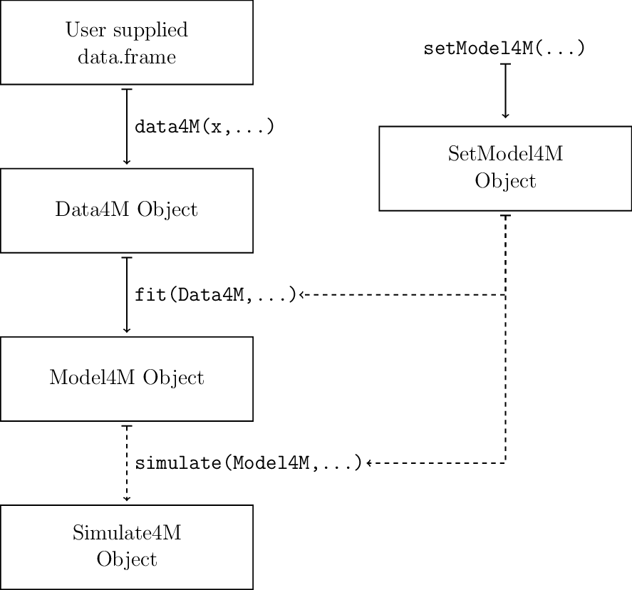

```{r setup, include = FALSE}
knitr::opts_chunk$set(
  collapse = TRUE,
  comment = "#>"
)
```

# Basic workflow

The simplest analysis using markmodmover works in two stages: create a `Data4M` object using the `data4M(x)`, and fit it using the `fit(Data4M)` command which creates a `Model4M` object. More in-depth analyses can also include more specialised models or fitting methods through the use of a SetModel4M object, while simulation studies are done through the `simulate(Model4M)` function, which creates a Simulate4M object.

{width=7in}

# An example analysis

To get a feel for the package, we will analyze a grey seal track three times. The first analysis will show the absolute minimum effort required to fit a model in the package. The second analysis will show what might be the "typical" analysis. The third will use more advanced features that may be useful in some specific cases.

At a minimum, the dataset requires a column matching "Date", a column matching "Latitude", and a column matching "Longitude". The `greyseal` data.frame included in the package has all of these columns.

```{r}
library(markmodmover,RColorBrewer)
head(greyseal)
```

## Bare Bones Analysis

The first step is to store our data in a `Data4M` object. All this takes is a simple call to the data4M function. Let's take a quick look at what is stored in `sealdata`, our new `Data4M` object.

```{r,cache=TRUE}
( sealdata<- data4M(greyseal) )
```

There are two main sections of the `sealdata` object: 1.) "Observed Locations", which essentially consists only of the data.frame we passed in as well as a few summary statistics, and 2.) "Interpolated Locations", which currently has nothing in it.

The summary statistics for the observed locations are how many observations are present, the temporal and spatial range of the data, and the distribution of times in between consecutive observations. The temporal and spatial range might be convenient for the user but aren't really used in the package. The number of observed locations is useful but not necessary to fit a model, so for now we won't bother with it.

The distribution of time differences, however, is very important for the next step of our analysis, which is pre-processing the observed locations. The models we are fitting require observations to be equally spaced in time, so we need to interpolate the observed locations to a regular time grid to get the interpolated locations. At the very least, all that we need to choose is the spacing of our time grid, which is the `Time.Step` in the code.[^Time.Step] We'll choose a time step of an hour and a half for now, since that is a nice round value close to the mean of the time differences.

[^Time.Step]: I need to implement a grid of time step and group cutoff levels, as well as an automated way of choosing the best time step.

```{r,cache=TRUE}
( sealdata<- interpolate(sealdata,Time.Step = 1.5) )
```

Now we can see that our new interpolated data consists of `nrow(interpolatedLocations(sealdata))` locations in `length(levels(groups(sealdata)))` groups. The data are split in to groups based on the value of the group cutoff (which defaults to be twice the time step) and the amount of time between consecutive observed locations. If the time between two locations is more than the group cutoff, then they are split in to different groups.

Now our `sealdata` object contains the observed locations, the interpolated locations, and also a set of step lengths and deflection angles. We can plot the object to get a sense of what all of these parts look like.

```{r,fig.show='hold',cache=TRUE}
plot(sealdata)
```

The plots of the data are joint density clouds that work just like histograms: a darker shade would correspond to a higher bar of a histogram. The first density cloud is deflection angle and step length where the counterclockwise angle from the x-axis gives deflection angle and distance away from the origin gives the step length. The second density cloud is a lag plot for step length which is useful in diagnosing conditional dependence and which model to fit. But again, we won't bother with this for now.

The final thing to do is just to fit a model to the data. The default model is a two state 4M, so we'll go with that for now.

```{r,cache=TRUE}
( seal4M2<- fit(sealdata) )
head(viterbiPath(seal4M2))
```

Our new `seal4M2` object contains all of the information stored in the `greyseal` object (it actually contains a copy of it) as well as the model definition (which is actually a copy of a `SetModel4M` object which we will look at in the advanced analysis), and a wealth of information concerning the fitted model. In addition to the parameter estimates, the `seal4M2` object holds the convergence message, the estimated behavioural state path, one-step ahead pseudoresiduals, and AIC. We can plot the interpolated locations with behavioural state estimates, as well as the residuals to check our model.

```{r,cache=TRUE}
plot(seal4M2,c("locations","residuals"))
```

When plotting the interpolated locations of a `Model4M` object, the estimated behavioural states are included by color coding each point. The first and last locations in each group are always black since behavioural states are unable to be estimated at those points.

For the residuals, the upper left panel is a plot of the autocorrelation function of the step length residuals. With the exception of Lag 0, all of the value should be within the blue dashed lines. The upper right is a density cloud lag plot of the step length residuals and should resemble random scatter. The bottom two panels are quantile-quantile plots and should lie on the line y=x. Putting all of the code together, we can perform a first glance analysis in just four lines of code. (Placing the assignment commands in parentheses automatically prints the object.)


```{r,eval=FALSE}
( sealdata<- data4M(greyseal) )
( sealdata<- interpolate(sealdata,Time.Step = 1.5) )
( seal4M2<- fit(sealdata) )
plot(seal4M2) ### This will plot all of the locations, data, and residuals.
```


## Typical Analysis

While the analysis above is adequate for simply fitting a model to data, we will often want to look more closely at the data and override some of the defaults of the package. For instance, we might want to manually choose a `Time.Step` and `Group.Cutoff`, fit a three state HMM, or conduct a simulation study. We also wouldn't want to make these choices blind. We can use the functionality of the package to easily inform our choices and implement them in our analysis.

As always, we first load the data into a `Data4M` object. The initial data.frame does not need to have exact column names. The `data4M` function looks for columns whose names include any of the substrings "date", "lon", or "lat", ignoring case. After finding these columns, it changes their name to be "Date", "Lon", and "Lat" and rearranges them in that order. We'll showcase this in the example.

```{r,cache=TRUE}
rm(sealdata,seal4M2)
newNamesSeal<- setNames(greyseal[3:1],c("date and time",
                                   "long winding",
                                   "laterally circling")[3:1])
head(newNamesSeal)

sealdata<- data4M(newNamesSeal)
head(observedLocations(sealdata))
```

If we need to we can access the components of any `Data4M` object, or other `4M-class` objects. To do this we use access functions such as observedLocations(x). To see all the available commands you can use the help function `?AccessData4M`. This will be more useful for inspecting `Model4M` and `Simulate4M` objects.

Now let's say we want to choose a time step that lives on a nicer looking grid than the default one. We can do this by supplying a `Time.Step` sequence and a `Group.Cutoff` sequence to the `timeGrid` function.[^timeGrid] Keep in mind that the Group.Cutoff sequence is given as a multiplier of the Time.Step.

[^timeGrid]: I need to write this function. Should return two matrices (one for nprop and one for nadj) and a suggested best value.

```{r,eval=F}
timeGrid(sealdata)
```

HERE WOULD BE A SECTION EXPLAINING OUTPUT OF `timeGrid` (bring up the definition of nprop and nadj).

```{r,cache=TRUE}
sealdata<- interpolate(sealdata,Time.Step = 66,units = "min")
plot(sealdata,c("loc","data"))
```

At this point we look at the step length lag plot to determine whether we should use the HMM or the 4M. This particular plot suggests we should use a 4M. We'll explore this later in a simulation study. However for the sake of exposition we will fit a three state HMM. We can do this by supplying the `fit` function with the optional parameters `Use.HMM = T` and `N.States = 3`.

```{r,cache=TRUE}
( sealHMM3<- fit(sealdata,Use.HMM = T,N.States = 3) )
```

Now let's plot the residuals to see if this three state HMM is actually a good model to use for this data.

```{r,cache=TRUE}
plot(sealHMM3,"residual")
```

While the Q-Q plots both look good, the ACF plot and the lag plot both have undesirable properties. The ACF at lag 1 is close to around 0.4, and the lag plot shows that most of the residuals lie on the line `r_{t} = r_{t-1}` especially in the upper right corner. Physically, the residuals lying on the line means that the HMM  generally predicts step lengths which are too far away from the previous step length (since the residuals are more "average" than expected). The dark spot in the upper right corner means that "unusually" large step lengths are surprising after having just seen an "unusually" large step length. 

This conditional autocorrelation is just the type of problem the 4M model was designed to overcome, so let's fit a three state 4M. We don't need to start all over: we can just re-`fit` our `sealHMM3` model.[^refitModel]

[^refitModel]: I need to change the code so that this returns the correct model fit.

```{r,cache=TRUE}
# ( seal4M3<- fit(sealHMM3,Use.HMM = F) )
( seal4M3<- fit(sealdata,N.State = 3) )
plot(seal4M3,"resid")
```

The residuals for this model look much better than the three state HMM. Not that we've found a model which works fairly well for the data, let's try and find out just how well this model performs using simulations. This is easy to do using the `simulation` function. We'll use only 10 simulations here, but in practice you might want to use more.

```{r,cache=TRUE}
sim4M3<- simulate(seal4M3,nsim = 10)
summary(stateError(sim4M3))
rmse(sim4M3)
```

The median state estimate error is `r median(stateError(sim4M3))`, but this could possibly be inflated by undetected non-convergent fits (see the later section on how to detect these). The package includes a function which returns a vector of indices showing which might be suspect.

```{r,cache=TRUE}
( badSims<- simCheck(sim4M3) )
sim4M3<- sim4M3[-badSims]
summary(stateError(sim4M3))
rmse(sim4M3)
mae(sim4M3)
```

Using all the above summary statistics simultaneously can be overkill -- normally you would only use rmse or mae (median absolute error) -- but as long as all of the parameters are small compared to the magnitude of the parameters there should be nothing to be worried about. The exception is when the true deflection angle concentration is small, then the corresponding deflection angle center does not matter so much and the `rmse` or `mae` can be large without much worry.

The `stateError` function computes the percentage of the refit Viterbi state path that does not agree with the actual simulated state path, for each simulation. Taking the summary of it gives a general idea of how well the Viterbi algorithm does at estimates the behavioural states. Another way to use the `stateError` function is help find simulations which did not converge correctly. Just because the `stateError` is high for a particular simulation does not mean that it can be thrown out, but often looking at the corresponding refit parameter estimates can show evidence of undetected non-convergence.

### Knowing when to use an HMM and when to use a 4M.

Since the 4M is an extension of the HMM, the most intuitive way of finding out whether we should the HMM or the 4M is to simply fit an HMM to see if it does an adequate job. This is exactly what we did in the preceding section. Even though it takes only seconds to fit these models, it would be nice if we could avoid fitting an HMM if we don't have to. Luckily (really, by design) the plots of the movement data exhibit different charactics in the HMM and the 4M. Let's do a simulation to see an example.

To easily inspect one particular simulation we can use double bracket `[[` subsetting. Whereas before the single bracket `[` subsetter returned another `Simulate4M` object, the double bracket `[[` subsetter will return a `Model4M` object. The `Data4M` part of the object will come from the simulated data -- this always starts at the same initial location and time as the original data -- while the `SetModel4M` comes from whatever `SetModel4M` object was used to refit the simulations, and the rest of the object comes from the refit parameters.

```{r,cache=TRUE,fig.height = 9}
example4M3<- sim4M3[[1]]
( exampleHMM3<- simulate(sealHMM3,nsim = 1)[[1]] )
plot(example4M3,"data",N.Greys = 50,N.Grid.Lines = 400)
plot(exampleHMM3,"data",N.Greys = 50,N.Grid.Lines = 400)
```

Compare the upper plots for the simulated 4M data with the lower plots for the simulated HMM data. There are subtle differences in the "Deflection Angle and Step Length" plots. While the 4M data is more elliptical and the HMM is more rectangular, there is not much reason to believe this holds in general. 

The "Step Length Lag Plot"s however, have differences which come with theoretical justification. As a result of the conditional (within-state) autocorrelation of the 4M, the lag plot has an oblongated smear lying very close to the line `d_{t} = d_{t-1}`.[^4Msmear] The HMM data more resembles rain droplets -- three circular patterns that correspond to the three states that the data were simulated from.

[^4Msmear]: When we saw a similar pattern in the *residuals* of the HMM, it was a cause of concern since the *residuals* should show random scatter if the model is correct. If the *data* show this pattern, then we should use the 4M to account for it.


## Advanced Features / Tips and Tricks

* SetModel4M object
  * Parameter mapping
  * Zero inflation
  * Starting values
* Identification
* TMB Environment -- I need to change the cpp and R code for simulation so I can use laplace checking
* Parallelization in simulate
* S4 Inheritance


# Detecting undetected non-convergence

There will be some times when a model "converges" to a boundary of the parameter space. Often when this happens we should try and fit the model again to get a estimates which are not on the boundary. This is because models on the boundary can violate some of the statistical theory which ensures that parameters are identifiable or consistent. Here are some things to look out for:

* Any estimated parameters which are equal to, or very close to, zero. Usually these will either be deflection angle concentrations of transition probabilities.

* Step length autocorrelations which are greater than 1. While these are not necessarily "wrong" estimates in all cases, they can indicate that something went wrong.

* Stationary distribution entries which are close to 0 are a special case. If this happens consistently you should try using fewer states in the model.

# NOT MY STUFF

## Figures

The figure sizes have been customised so that you can easily put two images side-by-side. 

```{r, fig.show='hold'}
plot(1:10)
plot(10:1)
```

You can enable figure captions by `fig_caption: yes` in YAML:

    output:
      rmarkdown::html_vignette:
        fig_caption: yes

Then you can use the chunk option `fig.cap = "Your figure caption."` in **knitr**.

## More Examples

You can write math expressions, e.g. $Y = X\beta + \epsilon$, footnotes^[A footnote here.], and tables, e.g. using `knitr::kable()`.

```{r, echo=FALSE, results='asis'}
knitr::kable(head(mtcars, 10))
```

Also a quote using `>`

> "He who gives up [code] safety for [code] speed deserves neither."
([via](https://twitter.com/hadleywickham/status/504368538874703872))
